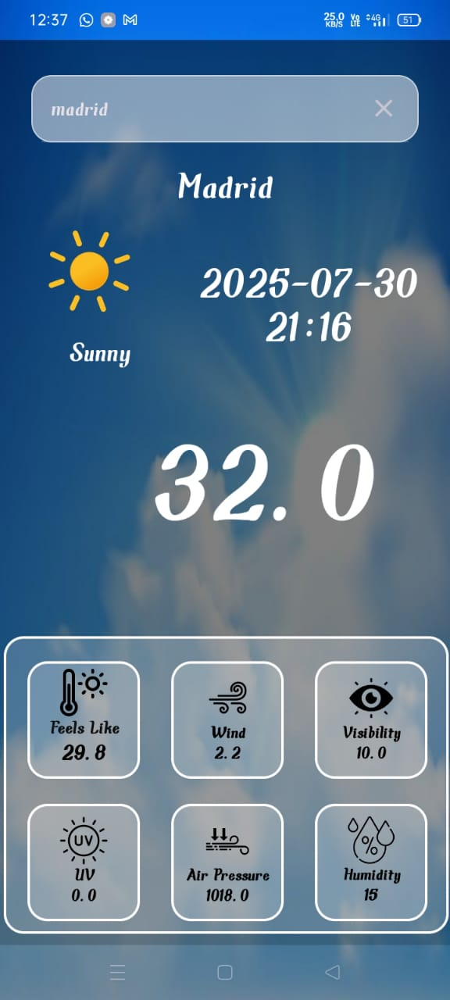

# 🌤️ Weather App

A simple Android weather application that fetches and displays real-time weather data for the entered location using the OpenWeatherMap API.

## ✨ Features
- Search current weather by city name
- Displays:
    - Temperature
    - Weather condition (like clear, rainy, cloudy)
    - Humidity and wind speed
- Real-time API fetch
- Simple and clean XML-based user interface

## 📱 Screenshots

### 🔍 Search and Result Page





## 🛠️ Tech Stack
- *Java*
- *Android Studio*
- *OpenWeatherMap API*
- *XML Layouts*

## 🔌 API Integration
- API: [OpenWeatherMap](https://openweathermap.org/api)
- Replace YOUR_API_KEY with your own API key in the code:
  ```java
  String apiUrl = "https://api.openweathermap.org/data/2.5/weather?q=" + city + "&appid=YOUR_API_KEY";